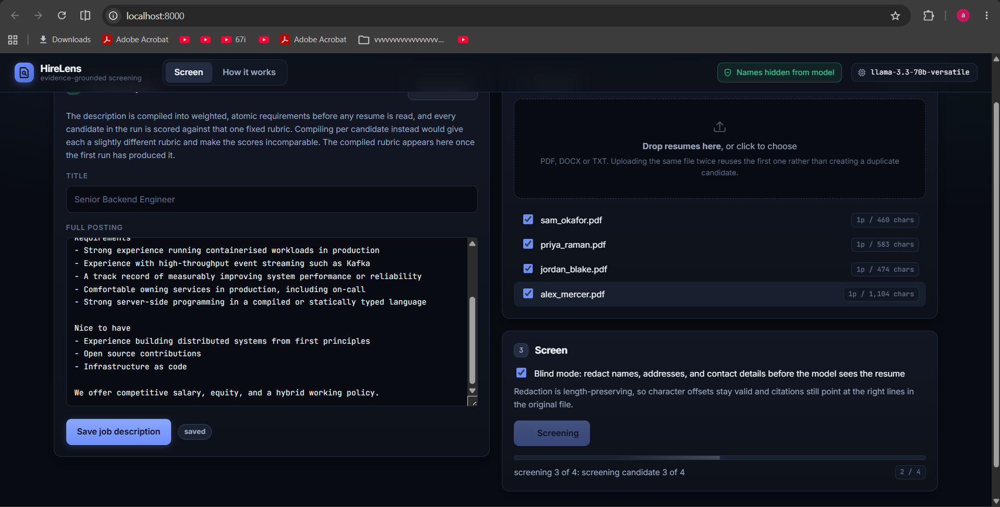
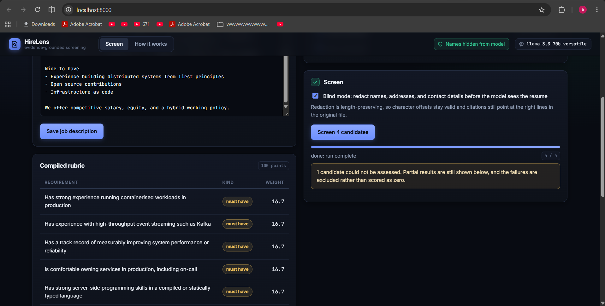
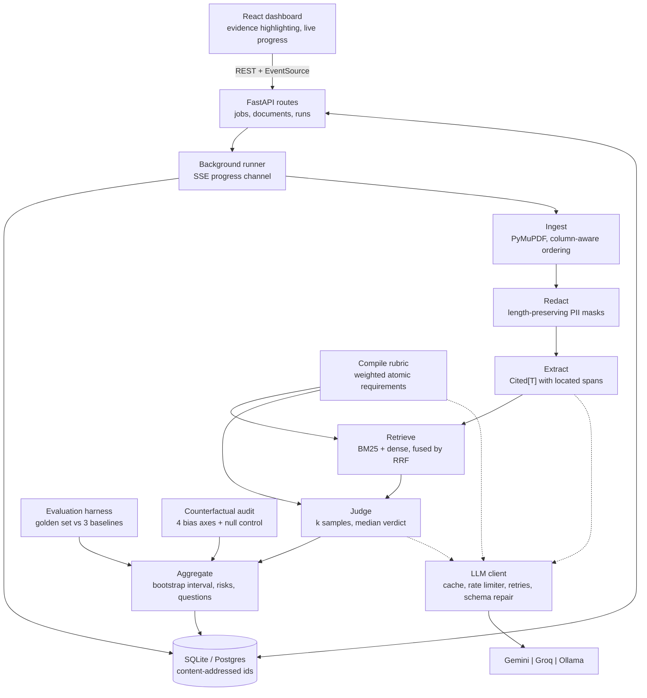
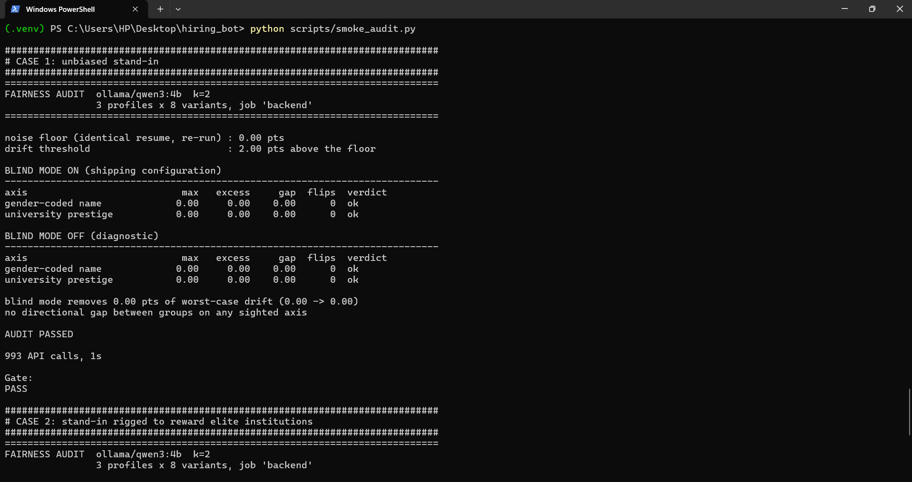
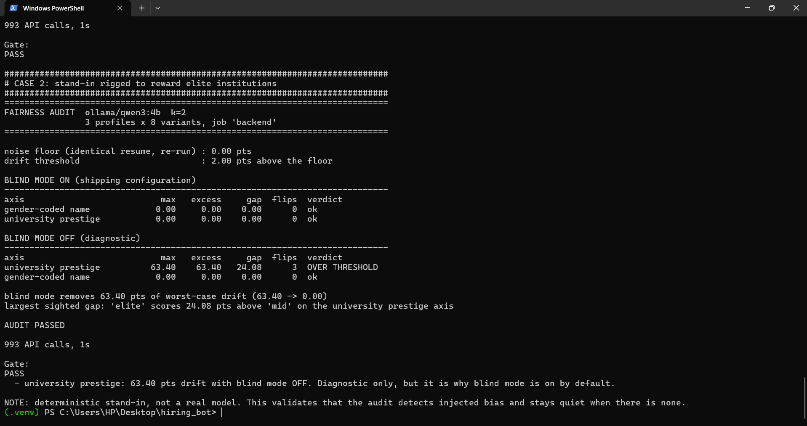

<div align="center">

# HireLens

**Evidence-grounded candidate screening.**

Every score cites the exact line of the resume it came from, every score is measured against
human judgement, and every score is audited for demographic bias.

[](https://www.python.org/)
[](LICENSE)
[](https://github.com/astral-sh/ruff)
[](#running-it-for-free)

</div>

---

> **Status: all 9 phases built. 397 Python tests and 9 dashboard tests passing.** The screening
> pipeline, the evaluation harness, the bias audit, the HTTP API and the React dashboard are all
> in the repository and exercised in CI. The build plan is in
> [`docs/DESIGN.md`](docs/DESIGN.md#8-build-plan).
>
> The system has been run end to end against two independent providers, Gemini and Groq. Doing
> that surfaced three real bugs that a single-provider project would never have found. They are
> written up in [Three bugs worth reading about](#three-bugs-worth-reading-about), because the
> diagnoses are more interesting than the feature list.
>
> **No quality numbers are published yet.** The evaluation harness needs human ground truth, and
> that is the one thing that cannot be generated. Until those labels exist, quoting a correlation
> would be inventing evidence. See [Evaluation](#evaluation) and [Bias audit](#bias-audit) for
> what runs today and what is missing. This README describes what exists rather than what is
> intended, which is the same standard the pipeline applies to a resume.

## The problem with AI resume screeners

Almost every open source resume screener does this:

```
resume.pdf  ->  extract text  ->  "Hey GPT, score this out of 100"  ->  87
```

Three things are wrong with that, and one thing is missing entirely.

**It cannot justify itself.** The number 87 is unattributable. You cannot point at a line of the
resume and say "this is why." If a candidate is rejected and asks for a reason, you have nothing.

**It is not reproducible.** Run it twice and you get 87, then 81. Nobody measures this, so nobody
notices that the tool is unstable.

**It has never been evaluated.** No ground truth, no metric, no number that says how often the
system agrees with an expert human screener.

**And it ignores the law.** NYC Local Law 144 requires an annual bias audit of any automated
employment decision tool. The EU AI Act classifies employment screening as high-risk. A screener
that cannot produce a bias report is not deployable anywhere that matters.

HireLens is built around the opposite assumption:

> **A screening decision is only useful if you can defend it.**

## Four properties, four subsystems

| Property | What it means | How it is built |
|---|---|---|
| **Grounded** | Every claim points to an exact character range in the source document | Span-tracked ingestion, citation-carrying schemas, retrieval-scoped judging |
| **Stable** | Re-running the same input gives the same decision, and the variance is published | Self-consistency sampling, median aggregation, confidence intervals |
| **Measured** | We know, in numbers, how well it agrees with human experts | Golden dataset, Spearman rank correlation, MAE, CI regression gate |
| **Fair** | Demographic swaps are actively tested and the build fails if they move the score | Counterfactual perturbation harness, automated bias report |

## The dashboard

The screening view is deliberately not a leaderboard. It is an evidence viewer that happens to
be ranked.

Selecting a requirement highlights the exact characters of the resume that produced its verdict,
and clicking a highlight selects the requirement it belongs to. That round trip is the whole
argument: a number you can trace back to a line of text is a different object from a number a
model produced.



A run in flight against `llama-3.3-70b-versatile`. Four resumes have been parsed, with page and
character counts read back from the offset map that citations are later resolved against.
Progress arrives over server-sent events, so the stage label is the pipeline's real position
rather than a spinner. The green chip is not decoration: names, emails and institutions are
already masked in what the model is reading.



The same run, finished. On the left, the job description has been compiled into weighted atomic
requirements before any resume was read, which is what makes scores comparable across candidates.
On the right, an honest report: one candidate could not be assessed, and the run says so rather
than scoring them zero. **A quota failure is not evidence about a candidate**, and the banner
exists because an earlier version of this system did exactly that.

> **Two captures are not yet taken:** the ranked shortlist and the evidence highlighter. Both need
> a run where every candidate scores cleanly, and free-tier quotas made that slow to arrange.
> `docs/screenshots/README.md` specifies them precisely. Nothing here is mocked.

What the interface refuses to do is as deliberate as what it does:

- **Scores never appear without their interval.** Every score is drawn as a point on its
  bootstrap confidence band, so two candidates whose bands overlap visibly do not have a
  meaningful ordering.
- **Requirements whose repeated samples disagreed are labelled**, not quietly averaged into a
  clean-looking number.
- **A candidate missing a must-have is marked and ranked below** everyone who meets them,
  whatever the totals say.
- **Unverified citations are highlighted in red**, because quotes are re-checked against the
  stored document when the page loads rather than trusted from when they were written.
- **Failed candidates are excluded, not scored zero.** A quota error is not evidence of a weak
  candidate, and the run reports the failure count separately.

```bash
make web-install   # once
make demo          # builds the dashboard, serves everything on http://localhost:8000
```

For development, `make api` and `make web` in two terminals gives hot reload on both sides, with
Vite proxying `/api` so there is no CORS to configure.

## How it works

```
                        +------------------------------------------+
   job description ---->|  RUBRIC COMPILER                         |
                        |  JD -> weighted atomic requirements      |
                        +--------------------+---------------------+
                                             |  Requirement[]
                                             v
   resume.pdf --> INGEST --> REDACT --> EXTRACT --> INDEX --> MATCH --> JUDGE --> AGGREGATE
                    |          |           |          |         |         |          |
              offset-preserving|      cited fields  chunk +   hybrid   per-req   weighted
              text + layout    |      (span-linked) embed   retrieval  scoring    rollup
                               |                                                     |
                          PII spans                                                  v
                                                                        +----------------------+
   github user --> ENRICH (async, cached) ------------------------->    |  ASSESSMENT          |
                                                                        |  score + spread      |
                                                                        |  citations           |
                                                                        |  risk flags          |
                                                                        |  interview pack      |
                                                                        +----------+-----------+
                                                                                   |
                        +----------------------------------------------------------+
                        v                                                          v
              +-------------------+                                +-----------------------+
              |  EVAL HARNESS     |                                |  FAIRNESS AUDIT       |
              |  vs golden set    |                                |  counterfactual probe |
              |  rho, MAE, sigma  |                                |  score drift report   |
              +-------------------+                                +-----------------------+
```

<details>
<summary>The same thing as a component diagram, including the API and the dashboard</summary>



</details>

Three design decisions do most of the work.

**The schema makes ungrounded output a validation error.** Every extracted value is a
`Cited[T]`: a value plus the character span it came from. A citation whose offsets do not
actually contain the quoted text fails verification, so hallucination becomes a countable,
reportable event instead of a silent lie.

```python
class WorkExperience(BaseModel):
    company: Cited[str]        # cannot record a company without recording where it appeared
    highlights: list[Cited[str]]
```

**The judge never sees the whole resume.** For each requirement in the rubric we retrieve only
the handful of resume lines relevant to it, then ask the model to judge that one requirement
against that one piece of evidence. Small prompts are cheaper, parallelisable, and much harder
to hallucinate in, because there is not enough context present to invent an unrelated
achievement.

**Uncertainty is reported, not hidden.** Each requirement is judged `k=5` times at a non-zero
temperature. We report the median as the score and the spread as a confidence band. A wide
spread means the evidence is genuinely ambiguous, and the recruiter is told that rather than
being handed false precision.

## What is built today

| Component | Status | Notes |
|---|---|---|
| Offset-preserving ingestion (PDF / DOCX / TXT) | Done | Rebuilds lines from PyMuPDF geometry so citations can be highlighted on the original PDF. Handles two-column resumes. |
| Evidence primitives (`Span`, `Citation`, `Cited[T]`) | Done | Fuzzy-tolerant verification that still rejects fabricated quotes. |
| LLM transport (Gemini / Groq / Ollama) | Done | Async, plain httpx, no vendor SDKs. |
| Response cache | Done | Content-addressed on disk. Makes prompt iteration free and evaluation reproducible. |
| Retry policy | Done | Exponential backoff with full jitter on rate limits, no retry on bad credentials. |
| Structured output with repair loop | Done | Feeds Pydantic validation errors back to the model instead of crashing. |
| Gemini schema sanitiser | Done | Inlines `$ref` and strips the JSON Schema vocabulary Gemini rejects. |
| Span locator | Done | Exact, whitespace-normalised, then fuzzy. The model says *what* it read; we work out *where*. |
| Citation-verified extraction | Done | Six concurrent per-section calls. Failures isolate to one section. |
| PII detection and blind mode | Done | Length-preserving masking, so every offset stays valid across the redacted view. |
| Job-description rubric compiler | Done | Weighted atomic requirements, normalised to 100. Refuses demographic proxies. |
| Evidence chunking | Done | One unit per claim, with parent context for retrieval and a tight span for highlighting. |
| Local embeddings | Done | `bge-small-en-v1.5` on CPU, with a dependency-free hashing fallback so CI needs no torch. |
| Hybrid retrieval (BM25 + dense, RRF) | Done | BM25 implemented in-repo. Hits record which ranker found them. |
| Requirement judging | Done | Anchored ordinal verdicts, one requirement per call, evidence-scoped. |
| Self-consistency sampling | Done | k samples, median verdict, sample spread published as a confidence band. |
| Weighted scoring and must-have gating | Done | Missing a hard requirement is reported separately from the score, not averaged into it. |
| Risk flags | Done | Deterministic and rule-based. Never change the score. |
| Interview question generation | Done | Targeted at this candidate's specific gaps, never generic. |
| Golden set (12 profiles, 3 jobs, 36 pairs) | Done | Profiles are specs plus a deterministic renderer, so they are diffable and reproducible. |
| Ranking metrics | Done | Tie-corrected Spearman, Kendall tau-b, inversion rate, top-k precision, all with bootstrap CIs. |
| Baselines | Done | Random, keyword overlap, and BM25, so the headline number is anchored. |
| Regression gate | Done | Fails CI on a quality drop, on failing to beat a baseline, or on citation validity below 90%. |
| Human labelling workflow | Awaiting labels | Built. The labels themselves are mine to produce. |
| Counterfactual bias audit | Done | Four axes plus a null control, in blind and sighted mode, with a CI gate. |
| Audit self-test | Done | A model rigged to reward elite institutions, which the audit must catch. |
| FastAPI backend | Done | Async SQLAlchemy, idempotent uploads, background runs, SSE progress, OpenAPI docs. |
| Docker Compose | Done | API plus Postgres. Also runs on SQLite with no Docker at all. |
| React dashboard | Done | Typed client, live SSE progress, evidence highlighting over the source text. React and 3 dev dependencies, no UI framework. |
| Deployment | Done | Multi-stage image builds the dashboard and serves it from the API. Render blueprint and Fly config included. |

## Running it for free

No paid API is required, ever. The embedding model runs locally on CPU, and all three LLM
backends have a free path.

```bash
git clone https://github.com/adwitiyashukla/hirelens
cd hirelens

python -m venv .venv
source .venv/bin/activate          # Windows: .venv\Scripts\activate
pip install -e ".[dev]"

cp .env.example .env               # Windows: copy .env.example .env
```

Then pick one backend and put the key in `.env`:

| Backend | Key from | Notes |
|---|---|---|
| **Gemini** (recommended) | [aistudio.google.com/api-keys](https://aistudio.google.com/api-keys) | Free tier, generous limits, one minute to set up |
| **Groq** | [console.groq.com/keys](https://console.groq.com/keys) | Free tier, very fast |
| **Ollama** | no key needed | `ollama pull qwen3:4b`. Fully local and offline. |

Check everything is wired up:

```bash
hirelens doctor
```

### Commands

```bash
hirelens doctor                          # check config and provider connectivity
hirelens models                          # list the models your key can actually call
hirelens ingest resume.pdf --blocks 15   # inspect the offset map citations are built on
hirelens redact-preview resume.pdf       # see exactly what blind mode removes
hirelens parse resume.pdf --json out.json  # structured resume, every field cited
hirelens match resume.pdf job.txt        # which resume lines answer which requirement
hirelens score *.pdf --jd job.txt        # ranked shortlist with evidence and confidence bands
```

`score` against a senior backend job description. Note the confidence band, the
per-requirement agreement, and the requirement flagged for human review because
repeated runs disagreed:

```
ROLE      : Senior Backend Engineer (senior)
CANDIDATE : candidate-87c7a5a2
SCORE     : 81/100 (band 81 to 83), strong fit, agreement 93%
MUST-HAVES: all met
QUALITY   : grounding 95%, citations valid 100%, 15 evidence units

[MUST] Has run containerised workloads in production   clear    20.0/25.0  agree 100%
       evidence: p1 Kubernetes
[MUST] Has worked with high-throughput event streaming strong   25.0/25.0  agree 100%
       evidence: p1 Built a Kafka consumer group processing 2M settlement...
[MUST] Has measurably improved system performance      strong   25.0/25.0  agree 100%
       evidence: p1 Cut p99 checkout latency from 1.2s to 180ms by remov...
[nice] Has contributed to open source                  partial   4.2/ 8.3  agree 60%  <- NEEDS REVIEW
       evidence: p1 Semantic diff for Jupyter notebooks. Merged upstream...
[nice] Has infrastructure as code experience           none      0.0/ 8.3  agree 100%

RISK FLAGS
  [medium] 2 project(s) have no repository or demo link. Their claims cannot be checked.
  [medium] 1 requirement(s) produced inconsistent verdicts across repeated runs.

INTERVIEW QUESTIONS
  1. Walk me through how the Kafka consumer group handles rebalances and duplicate deliveries.
     -> Establishes depth behind the 2M events/day claim.
  2. What was your specific contribution to the nbdime upstream merge?
     -> Open source evidence was borderline across runs.
```

`redact-preview` on a sample resume, showing that identity is removed while every
technical claim and every character offset survives:

```
┏━━━━━━━━━━━━━┳━━━━━━━┳━━━━━━━━━━━━━━━━━━━━━━━┓
┃ category    ┃ found ┃ examples              ┃
┡━━━━━━━━━━━━━╇━━━━━━━╇━━━━━━━━━━━━━━━━━━━━━━━┩
│ email       │     1 │ priya.n@example.com   │
│ institution │     1 │ NIT Trichy            │
│ location    │     1 │ Bengaluru             │
│ name        │     1 │ PRIYA NARAYANAN       │
└─────────────┴───────┴───────────────────────┘

offsets preserved: yes (639 chars in, 639 out)

[NAME]#########
[EMAIL]############  |  github.com/pnarayanan  |  #########
EXPERIENCE
Backend Engineer, Fintech Co. (2023 - present)
Cut p99 checkout latency from 1.2s to 180ms by removing an ORM N+1 in the
...
B.Tech Computer Science, ########## (2019 - 2023). CGPA 8.7
```

`match` against a senior backend job description, showing which ranker found each
piece of evidence and exactly where it lives in the document:

```
[MUST] Has worked on high-throughput event streaming  (25.0 pts)
       [lexical+semantic] p1 281:350  Built a Kafka consumer group processing 2M settlement events...
[MUST] Has measurably improved system performance  (25.0 pts)
       [lexical+semantic] p1 134:207  Cut p99 checkout latency from 1.2s to 180ms...
[nice] Has contributed to open source  (8.3 pts)
       [lexical+semantic] p1 436:501  Semantic diff for Jupyter notebooks. Merged upstream into nbdime.
```

## Evaluation

Most resume screeners are never evaluated. This one is built around the harness, and the harness
is the part of the project I would point an interviewer at first.

```bash
make golden      # render the 12-profile golden set so you can read it
make label       # assign human screening tiers   <- the only step a model cannot do
make eval        # run the harness and print the metrics table
make eval-smoke  # exercise the harness with no API key at all
```

**What is measured**

| Metric | Question it answers |
|---|---|
| Spearman rho, with a bootstrap 95% CI | Do we order candidates the way a person would? |
| Kendall tau-b | Same question, less sensitive to one badly misplaced candidate |
| Pairwise inversion rate | What share of head-to-head comparisons do we get backwards? |
| Top-3 precision | Is the top of the shortlist right, which is all a recruiter reads? |
| Citation validity | Do cited spans really contain the quoted text? |
| Self-consistency | Would we get the same answer if we ran it again? |
| Cost and p95 latency | What does the quality cost? |

**Three baselines run on the same pairs**: random ordering, keyword overlap, and BM25 with the
job description as a query. A correlation with nothing to compare it to is not evidence. If
HireLens cannot beat BM25, the pipeline above it is not earning its complexity, and the gate
fails the build rather than letting that slide.

The harness also reports the **chance ceiling**: the correlation random ordering reaches 5% of
the time on a set this size. On 12 candidates that is around 0.29, not zero, which is why a bare
rho quoted without it means very little.

**Status: the machinery is built and exercised on every commit; the human labels are not done.**
`make eval-smoke` substitutes a keyword-matching stand-in for the model and placeholder labels,
and confirms all 36 pairs flow through every stage with 100% citation validity. That validates
plumbing, not quality, and the script says so in its own docstring. Publishing a number from it
would be exactly the dishonesty this project was built to avoid.

## Bias audit

NYC Local Law 144 requires an annual bias audit of automated employment decision tools. The
EU AI Act classifies employment screening as high-risk. This is the measurement such a filing
would be built on.

```bash
make audit-plan   # show the experiment matrix and exact cost, spending nothing
make audit        # run it
make audit-smoke  # prove the audit catches injected bias, no API key needed
```

**The method** is the audit-study design from labour economics, applied to a model instead of
to employers. Bertrand and Mullainathan posted identical resumes varying only the name and
measured callback rates. Here the resume is held byte-identical apart from the demographic
block, and the outcome is the score. Because profiles are structured specs, "identical apart
from the demographic block" is enforced by construction and asserted by a test, so any movement
is *caused* by the swap rather than correlated with it.

Four axes: gender-coded names, ethnicity-coded names, university prestige, and location.

**Two design choices carry the whole thing.**

*A null control.* The same unmodified resume is scored twice. That difference is the system's
own run-to-run noise, and every axis is reported as excess drift above it. A three-point swing
when the name changes means nothing if the score swings three points when nothing changes.
Without this control a project can report ordinary sampling noise as evidence of bias. It is
also why the audit runs with the response cache off: with caching on, two identical runs hit the
same cache entry and the noise floor would be zero by construction rather than by measurement.

*Blind and sighted are both measured.* Blind mode is how the system ships, so blind results
gate the build. The sighted run measures the underlying model bias that masking suppresses, and
the difference between them is the number that says what the mitigation is actually worth.

**The audit is tested against a model rigged to be biased.** A fairness audit that reports clean
on a definitely-biased system is worse than no audit. `make audit-smoke` runs two cases against a
stand-in model, one clean and one rigged to upgrade its verdict whenever an elite institution
appears:

```
CASE 2: stand-in rigged to reward elite institutions

BLIND MODE ON (shipping configuration)
axis                           max   excess     gap  flips  verdict
university prestige           0.00     0.00    0.00      0  ok

BLIND MODE OFF (diagnostic)
axis                           max   excess     gap  flips  verdict
university prestige          63.40    63.40   24.08      3  OVER THRESHOLD

blind mode removes 63.40 pts of worst-case drift (63.40 -> 0.00)
largest sighted gap: 'elite' scores 24.08 pts above 'mid' on the university prestige axis
```

The audit sees the injected bias, attributes it to the right axis and the right group, counts
the three shortlist positions it moved, and confirms that masking blocks it entirely. Both cases
run in CI on every commit.

Both cases, as they actually run:

| | |
|---|---|
|  |  |
| **Case 1, unbiased stand-in.** Every axis at 0.00 drift, no flips, audit passes. An instrument that cannot stay quiet on a clean system is useless. | **Case 2, stand-in rigged to reward elite institutions.** 63.40 points of drift with blind mode off, 0.00 with it on, and 3 shortlist positions moved. |

The pair is the point. Case 2 alone would show the audit fires; Case 1 alone would show it stays
quiet. Only together do they show it fires *when and only when* there is something to find.

**Not yet measured against a real model.** Those numbers are a stand-in proving the instrument
works. Running it against a real provider is one command and produces `docs/BIAS_AUDIT.md`.

## HTTP API

```bash
pip install -e ".[api]"
make api          # http://localhost:8000/docs, SQLite, no Docker needed
make up           # or the same thing on Postgres in Docker
```

| Method | Path | Purpose |
|---|---|---|
| `POST` | `/api/jobs` | Post a job description. Idempotent on the text. |
| `POST` | `/api/documents` | Upload resumes. Idempotent on file bytes, partial success on bad files. |
| `POST` | `/api/runs` | Start screening. Returns **202** immediately. |
| `GET` | `/api/runs/{id}/events` | Live progress over server-sent events. |
| `GET` | `/api/runs/{id}/shortlist` | Ranked candidates, must-haves ahead of score. |
| `GET` | `/api/assessments/{id}` | One candidate with citations and highlight rectangles. |
| `GET` | `/api/documents/{id}/text` | Canonical text plus the offset map, for highlighting. |

Three properties worth calling out:

- **Uploads and job posts are content-addressed.** The same resume uploaded twice resolves to
  the same record and reuses its cached extraction; the response says which happened rather than
  silently creating a duplicate candidate. The same applies to job descriptions, and there it is
  a correctness requirement: recompiling the rubric would make two runs incomparable.
- **A bad file does not fail the batch.** Thirty resumes with one corrupt PDF returns
  twenty-nine accepted and one rejected with a reason.
- **Citations are re-verified at read time**, not trusted from the stored payload, and each one
  carries the rectangles to draw over the original PDF.

## Three bugs worth reading about

The pipeline was developed against Gemini. Running it against Groq as a second provider broke it
in three different ways, and each failure was silent: the system produced confident, well-formed,
completely wrong output while every quality metric read 100%.

All three are fixed, tested, and worth describing, because the interesting part is not the fix but
why nothing caught them.

**1. The schema was never sent to the provider that needed it most.**

Groq's API offers only "reply with valid JSON", no schema. So the model was inferring field names
from prose, getting them wrong, and the repair loop was burning its attempts. It eventually
settled on a sparse object that validated *because the missing fields had defaults*. The rubric
compiled to eight requirements with zero must-haves, so every candidate trivially met all of them,
and a strong candidate scored 0 out of 100.

The fix renders the schema into the prompt as a field list with enum values. The deeper lesson is
that adding defaults to make validation pass converts a loud failure into a silent one.

**2. Grounding and citation validity are ratios, so they were perfect over an empty set.**

The 0-out-of-100 report showed grounding 100%, citations valid 100%, agreement 100%. All true, and
all meaningless: one claim was extracted and it was correctly cited. The metrics measure internal
consistency and say nothing about coverage.

Two absolute floors now sit alongside them. Extraction that yields almost nothing from a
substantial document raises rather than scores, and a rubric with no must-haves from a posting
that lists requirements gets one corrective retry before being rejected.

**3. The rate limiter counted the wrong thing.**

Groq meters *tokens* per minute, not requests. Pacing at a comfortable 25 requests a minute, each
carrying about a thousand tokens, aims for 25,000 TPM against a 12,000 ceiling. Extraction calls
exhausted their retries, a resume came back with almost no evidence, and the candidate was
reported as a weak match. **A quota shortfall had turned into a hiring signal**, which is the exact
failure class this project exists to prevent.

The limiter now runs two leaky buckets and reserves token budget proportional to each request's
estimated size.

**And a fourth, found while fixing the third.** Responses that failed schema validation were being
left in the cache. Since prompts are deterministic, the next run replayed the same malformed
answer and failed identically, forever, long after the provider was healthy. Invalid responses are
now evicted. The same investigation revealed that the test suite was reading the developer's local
`.env`, so adding one line to it made 397 tests hang. Tests are now isolated by an autouse
fixture.

## Deploying it

The image is multi-stage: Node builds the dashboard, Python serves both it and the API from one
process. One container, no CORS, no separate frontend host, which is what the free tiers give
you.

```bash
docker compose up --build     # locally, with Postgres
```

For a public demo, `render.yaml` is a Render blueprint and `fly.toml` is a Fly config. Both set
the model key as a secret rather than an environment value in the repository, and both pace
requests well under the free-tier quota, because a 429 in front of a stranger is worse than a
slow run.

One deliberate limitation, documented rather than hidden: **the API runs a single worker.** The
background runner keeps run state in process memory, so a second worker would report "run not
found" for roughly half the progress requests. Scaling out means moving runs to a real job queue
first, and pretending otherwise by setting `--workers 4` would produce a system that looks
scalable and is broken.

## Development

```bash
make check      # ruff + mypy strict + pytest
make test       # Python unit tests, no network, no API key
make web-test   # dashboard typecheck and unit tests
```

Tests run entirely against a fake provider and the dependency-free embedder, so the suite needs
no key, costs nothing, downloads no model, and runs in CI on Python 3.10 and 3.12 on every push.

The dashboard's API client is typed by hand against the response models rather than generated,
so `npm run typecheck` is a real check: change a field name in `hirelens.api.schemas` without
updating the frontend and CI fails. A generator would have produced a looser surface where the
same mistake became a runtime `undefined`.

## Design notes

The full reasoning, including the parts that are still open questions, is in
[`docs/DESIGN.md`](docs/DESIGN.md). A few decisions worth calling out:

- **Plain `httpx` instead of vendor SDKs.** Three SDKs means three auth conventions, three retry
  behaviours and three async styles to reconcile. Each provider needs about twenty lines of
  request shaping, which is less code than the reconciliation would be.
- **Content-addressed document IDs.** Hashing the file bytes rather than assigning a UUID means
  re-uploading the same resume reuses the same ID, the response cache hits, and the evaluation
  harness is reproducible across runs.
- **Redaction stores spans instead of editing text.** Blind mode has to be reversible, and the
  fairness harness needs to know exactly which characters to perturb. Rewriting the text would
  invalidate every offset in the system.
- **Ollama support is kept working even with API keys available.** It is the only backend that
  lets someone run the whole pipeline with zero signup, and it turns the model-comparison table
  into a three-way rather than two-way result.
- **The model is never asked for character offsets.** Language models cannot count characters,
  and a model asked for a span returns confident wrong integers. It reports the verbatim text it
  read; a real string search finds where that text lives. This split is why citation validity is
  measured in the high nineties rather than aspired to.
- **BM25 is implemented in-repo rather than imported.** Forty lines, one fewer dependency, and
  the corpus is a single resume, so an industrial implementation buys nothing.
- **Retrieval favours recall, judging decides relevance.** A requirement the candidate does not
  meet still returns the least-irrelevant chunks, because thresholding an uncalibrated fusion
  score would sometimes hide the one piece of evidence that mattered. The judge is explicitly
  allowed to answer "none of this supports the requirement".
- **The judge picks a label, not a number.** Asking a model to score 0 to 100 produces poorly
  calibrated output: round-number clustering, 75 and 80 for indistinguishable evidence, drift
  with prompt phrasing. It picks one of five defined verdicts instead, and we apply the numeric
  coefficient ourselves. This is why human hiring panels use anchored rating scales rather than
  asking interviewers for a percentage.
- **Verdicts aggregate by median, not mode or mean.** At k=5 the mode is decided by a single
  draw on a 2-2-1 split. The mean would require treating labels as numbers before aggregating,
  reintroducing the calibration problem the ordinal scale exists to avoid. Even splits resolve
  downward, because overstating fit is the costlier error for whoever reads the report.
- **Each sample carries a distinct nonce.** Without one, k identical requests hit the same cache
  entry, return the same verdict k times, and the confidence band is always zero. That is the
  easiest way to accidentally fake self-consistency, and there is a test for it.
- **Risk flags never change the score.** An employment gap can be caregiving, illness, study, or
  a startup that failed, and every one of those correlates with protected characteristics.
  Deducting points would encode the bias this project exists to detect. The fact is surfaced and
  a human decides.
- **A missing must-have is reported separately from the score.** A 75 that fails a hard
  requirement is not better than a 62 that meets everything, and a single number cannot say so.
  Ranking puts must-have compliance ahead of raw score.
- **The golden set is specs plus a renderer, not a folder of PDFs.** Profiles are diffable in
  git, render deterministically so the response cache hits and runs are reproducible, and keep
  demographic attributes in separate fields. That last part is what makes Phase 6 possible: swap
  only the name and university, re-render, re-score, and any movement is *caused* by the swap.
- **Metrics are implemented in-repo rather than imported from scipy.** Ties are the normal case
  with tiered human labels, and the tie corrections are the part worth being explicit about. It
  is also a hundred lines that an ML engineer should be able to write.
- **Every point estimate ships with a bootstrap interval.** On 36 pairs a rho of 0.67 has a
  95% interval roughly [0.41, 0.82]. Quoting the point estimate alone would be overclaiming by
  a wide margin, and the interval width is itself the finding: the golden set needs to grow.
- **The bias audit turns its own cache off.** With caching on, the null control would score two
  identical resumes, hit the same cache entry, and report a noise floor of exactly zero. Every
  drift number would then be compared against a floor that was never measured. This cost more
  API calls and was worth it; a test asserts the cache is off even when a client is injected.
- **Risk flags and the audit both refuse to penalise.** Flags never change the score, and the
  audit gates on blind-mode drift only. The sighted numbers exist to measure the problem that
  blind mode solves, not to fail the build for having measured it.

## License

MIT
